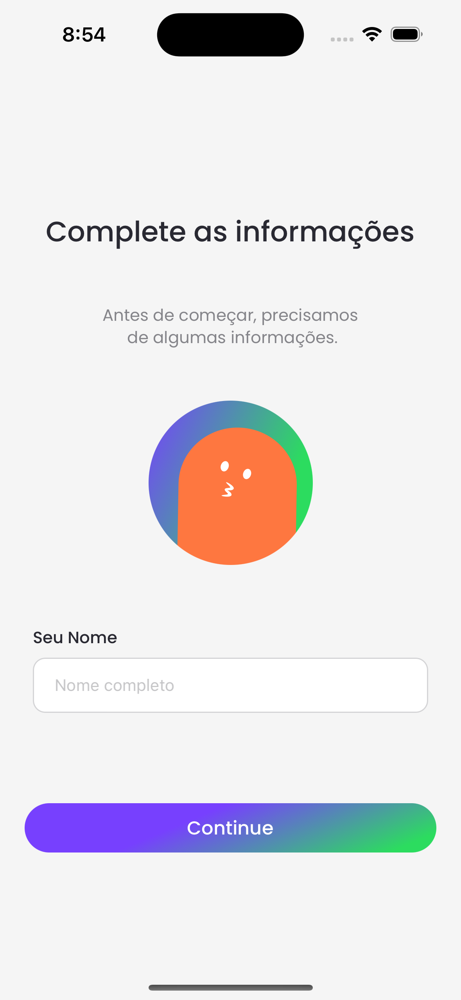
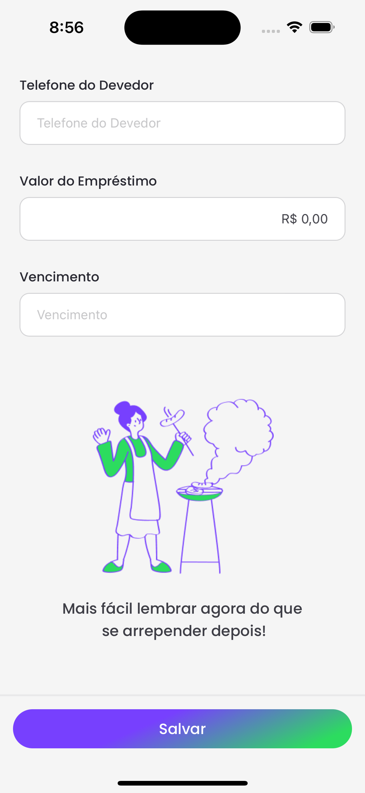
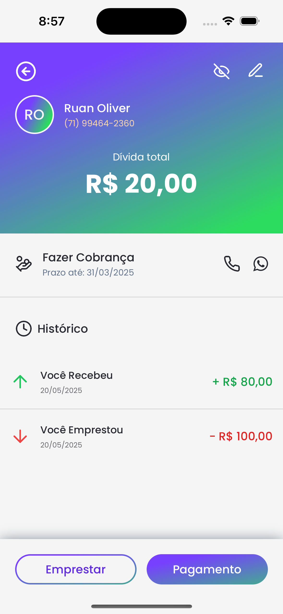
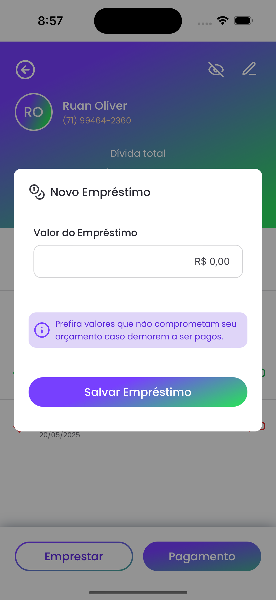

# 📱 Quem Me Deve #

Is a simple mobile app built with React Native, designed to help users manage and track personal debts in a practical and intuitive way.

This app is ideal for anyone who needs a clear and organized way to keep track of informal loans, helping users avoid forgetfulness and maintain better financial control.

## 🚀 Technologies ##

  
  
  
  
  
  
  
  
  

## 📦 Installation ##

1. Clone the repository:
```bash
  git clone https://github.com/CaioAReis/Quem-me-Deve.git
  cd Quem-me-Deve
```

2. Install dependencies:
```bash
  npm install
  # ou
  yarn
```

3. Start the server:
```bash
  npx expo start
```

## 🏆 Folder structure ##

```bash
  📂 src                // Root directory
  |--📁 @types          // Component types
  |--📁 app             // Application Pages
  |--📁 assets          // Stores static files like images and fonts
  |--📂 components      // Reusable components
  |  |--📁 layout       // Application Layout Components
  |--📁 data            // Static data or data models
  |--📁 features        // Specific modules by grouping components and logic
  |--📁 hooks           // Custom hooks
  |--📁 lib             // External libraries, utilities or integrations
  |--📁 services        // API calls, external services or integrations
  |--📁 store           // Manage global state
  |--📁 utils           // Utility and helper functions for general use
```

## 🧪 Tests ##
```bash
npm test
# ou
yarn test
```

## 📷 ScreenShots ##

<p align="center" display="flex">
  
  
  
</p>

<p align="center" display="flex">
  
  
  
</p>

<p align="center" display="flex">
  
  
  
</p>

<p align="center" display="flex">
  
  
  
</p>